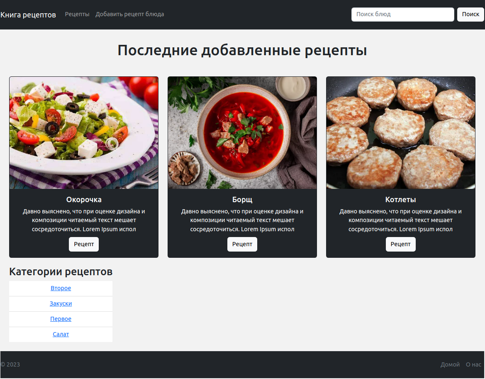

# Web-приложение кулинарная книга
- Ресурс для того чтобы помочь приготовить абсолютно любое блюдо

## Стек технологии
- Python == 3.10
- Django == 4.1
- DRF == 3.14
- PostgreSQL
- Docker

## Структура проекта
- Django проект распололжен в папке recipe
- REST API сервис расположен в папке api

## Инструкция по запуску на Docker
- Соберем новый образ и запустим два контейнера `docker-compose up -d --build`
- Проверьте наличие ошибок в журналах `docker-compose logs -f`